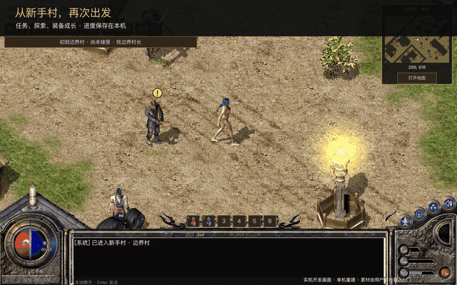
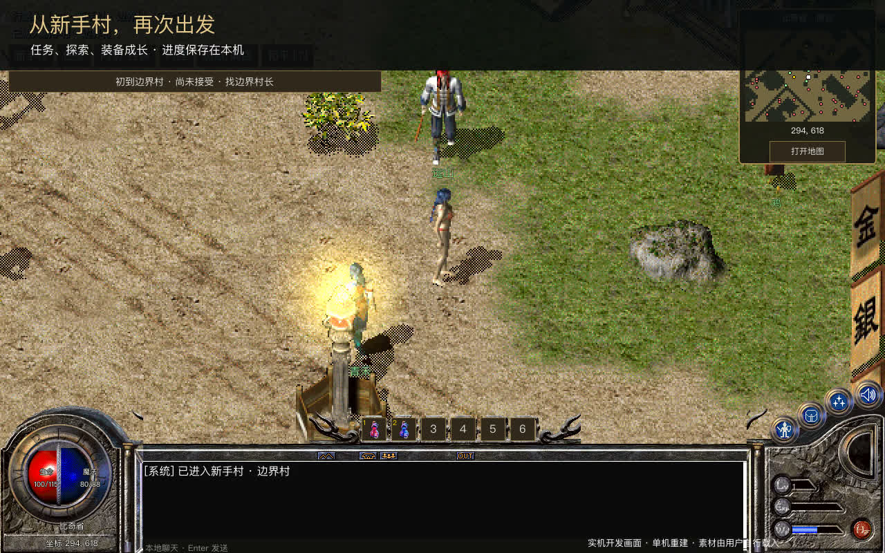
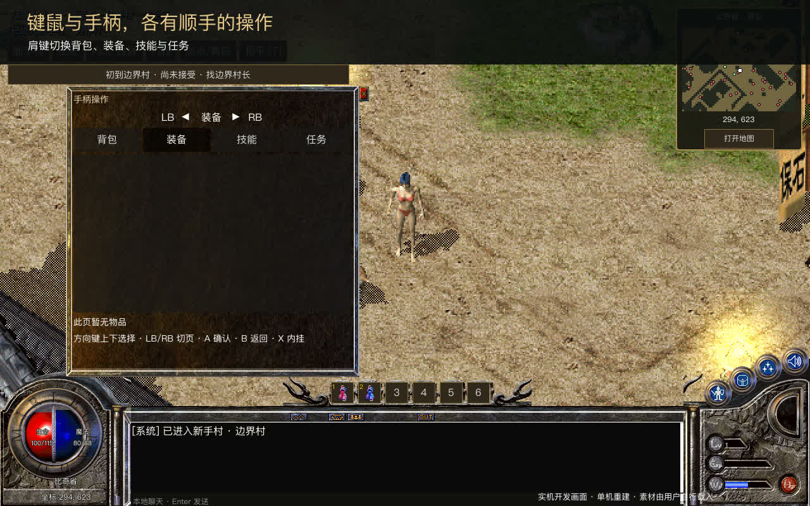
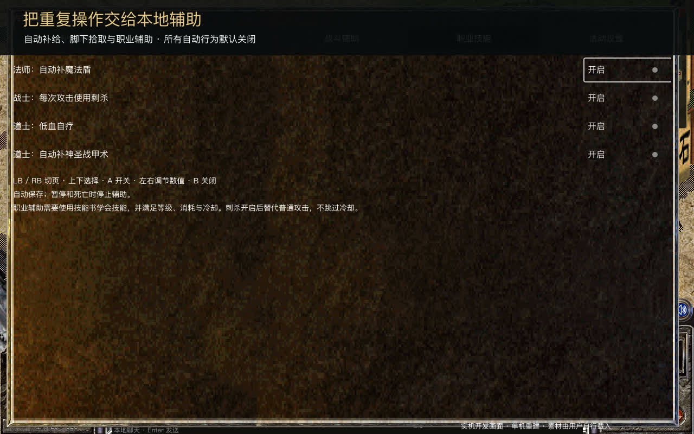

<div align="center">

# 玛法 · 火龙神殿

**回到玛法，按自己的节奏冒险。**

经典像素风 · 单机重建 · 键鼠与手柄 · 本地存档

[](https://github.com/M0Yi/mafa-native/actions/workflows/release.yml)


[**下载游戏**](https://github.com/M0Yi/mafa-native/releases/tag/v0.14.0-preview.2) · [**观看 45 秒宣传片**](https://github.com/M0Yi/mafa-native/releases/download/v0.14.0-preview.2/MafaNative-preview.mp4) · [**首次启动**](#三步开始冒险) · [**项目介绍**](release/宣传文章.md)

[](https://github.com/M0Yi/mafa-native/releases/download/v0.14.0-preview.2/MafaNative-preview.mp4)

*以上为实机演示画面。点击预览可打开完整 MP4；GitHub 或浏览器可能以下载方式打开。*

</div>

> **开始前请准备客户端素材。** 程序包不附带可供游戏加载的热血传奇原始或转换素材。基础适配 **2.0.1.11 十周年客户端**，十六周年客户端可选补充。首页图片和视频仅作功能演示，不是可用素材包。

## 这段旅程里有什么

从新手村出发，与 NPC 交谈，完成委托、学习技能、整理装备，继续探索城镇与野外。这里保留经典像素画面，也为本机游玩补上了更方便的操作方式。

| 玩法 | 当前可以体验 |
| --- | --- |
| 角色与成长 | 本机注册登录、角色创建、战法道技能书学习与装备成长 |
| 探索与任务 | 村庄委托、区域旅行、NPC 对话与服务、任务进度保存 |
| 战斗与拾取 | 怪物战斗、地面掉落、手动拾取及可选脚下自动拾取 |
| 装备与物品 | 背包、装备、商店与仓库等日常管理 |
| 手柄操作 | 独立面板，LB / RB 切换背包、装备、技能与任务 |
| 本地辅助 | 自动补给、拾取过滤、职业技能辅助；自动行为默认关闭 |

技能需要通过技能书学习。职业辅助支持法师补魔法盾、战士使用刺杀、道士自疗与护甲，并遵守等级、消耗和冷却。

## 实机画面

### 从新手村再次出发



### 手柄有自己的操作面板



### 把重复操作交给可配置的辅助



[观看完整宣传片 →](https://github.com/M0Yi/mafa-native/releases/download/v0.14.0-preview.2/MafaNative-preview.mp4) · [阅读项目介绍 →](release/宣传文章.md)

## 下载游戏

当前版本：**0.14.0-preview.2**。每个包包含程序及独立素材导入器，玩家无需安装 Python 或搭建服务端。

下表对应这个已发布预览版的历史验证记录。当前源码还有收尾修复，未重新打包；源码自动回归通过不表示下载包已包含这些修复。当前源码的 Windows/Linux 图形运行、实体手柄和两小时前台稳定性仍待验收。

| 平台 | 下载 | 验证情况 |
| --- | --- | --- |
| macOS · Apple Silicon | [下载 ARM64 ZIP](https://github.com/M0Yi/mafa-native/releases/download/v0.14.0-preview.2/MafaNative-0.14.0-preview.2-macOS-arm64.zip) | 本机外部素材导入与运行检查、CI 构建通过 |
| Windows · x86_64 | [下载 Windows ZIP](https://github.com/M0Yi/mafa-native/releases/download/v0.14.0-preview.2/MafaNative-0.14.0-preview.2-Windows-x86_64.zip) | CI 构建与基础启动通过，完整游玩待实测 |
| Linux · x86_64 | [下载 Linux ZIP](https://github.com/M0Yi/mafa-native/releases/download/v0.14.0-preview.2/MafaNative-0.14.0-preview.2-Linux-x86_64.zip) | Ubuntu 24.04 构建与基础启动通过 |

Linux 建议 Ubuntu 24.04 或兼容的 glibc 环境。macOS 包未公证，Windows 包未使用商业代码签名。下载页附每份程序包的 SHA-256 与素材审计报告。

[全部发布文件与更新说明](https://github.com/M0Yi/mafa-native/releases/tag/v0.14.0-preview.2) · [详细验证记录](release/VALIDATION.md)

## 三步开始冒险

1. **解压并启动。** macOS 打开 `MafaNative.app`；Windows 打开 `MafaNative.exe`；Linux 运行 `MafaNative.x86_64`。
2. **选择本机客户端。** 指定包含 `Data`、`Map`、`Wav` 的十周年客户端目录；有十六周年目录时可同时选择作为补充。等待首次转换完成。
3. **创建角色，进入游戏。** 素材缓存生成后会复用，账号和进度保存在本机，正常游戏无需联网。

导入只读取原始文件，不执行客户端 EXE，不修改原目录。转换可能需要数分钟和数 GB 空间。十六周年客户端不能单独代替基础素材；本仓库不提供客户端下载。

[完整启动说明与存档位置](release/README.zh-CN.md)

### 没有素材时能启动吗？

可以打开程序，显示“玛法 · 本机资源设置”；素材准备完成后才能进入角色与游戏场景。这个页面支持导入原始客户端目录，也支持载入包含 `client2011` 的已转换缓存目录。它是本机资源入口，不提供客户端下载或自动更新。

当前源码会检查已保存的缓存路径，缺失或损坏时提示重新选择。开发版可在项目根目录执行以下命令，主动回到资源设置页，无需删除现有配置或存档：

```sh
./启动最新开发版.command -- --asset-setup
```

此处描述当前源码行为；下载页旧预览包的具体修复范围以其发布说明为准。

## 常用操作

| 键鼠 | 功能 | 手柄面板 | 功能 |
| --- | --- | --- | --- |
| WASD / Shift | 移动 / 跑步 | LB / RB | 分类切页 |
| 左键 / E | 寻路、交互 / 近处交互 | 方向键 | 选择条目、调节数值 |
| 空格 | 基础攻击 | A / B | 确认 / 返回 |
| B / P | 背包 / 暂停 | X | 打开内挂设置 |

技能通过技能书学习后，按 Q 施放当前技能，按 R 切换技能；当前没有任意键位重绑定界面。键鼠面板与手柄面板各自保留对应操作。

## 死亡与安全区（当前源码开发版）

死亡后可留在灰色画面等待 30 秒回到新手村，也可返回角色选择再进入，立即在就近城市安全区复活。复活保留装备和金币；如果保存失败或城市地图无法载入，选角页会显示原因，恢复后可重试。

就近城市按现有地图出口连接选择，同一地图内选择最近的安全区。安全区在地面显示浅绿色范围、边界线与“安全区”文字；边界内的整格均受保护。标记不会扩大原有保护范围。该标记是本地适配，尚未核实并还原正版安全区特效。

以上为当前源码行为，尚未重新打包进下载页的旧预览包。开发时从项目根目录运行 `启动最新开发版.command`。

## 当前版本的边界

这是社区制作的**单机重建预发布**，不是原游戏官方客户端，也不是私服服务端。当前以已有玩法收尾，不宣称历史内容已完整还原。

- 707 张地图已登记接入，不等于每张地图的历史内容均已复原；部分场景使用登记的替代素材。
- 部分技能仍缺完整表现：困魔咒、地狱火、地狱雷光尚未接入原帧特效，灵魂火符缺飞行段；已接入的技能也未全部完成音画验收。当前源码记录见[技能表现修复与缺口](docs/SKILL_EFFECTS_REPAIR.md)。
- 当前不支持局域网或互联网联机。
- Windows/Linux CI 检查不能替代完整硬件游玩；实体手柄、操作页面与代表场景的视觉、长时间性能仍需要实测；本次收尾不逐张验收全部地图。
- 宣传片使用独立演示角色录制，配乐为独立合成，不代表原作音乐还原验收。
- 替代贴图、技能声音与退出音频残留的具体限制见[素材与音频验收边界](release/ASSET_ACCEPTANCE_LIMITS.md)。

遇到问题可[提交反馈](https://github.com/M0Yi/mafa-native/issues)，附上系统、程序版本、复现步骤和错误提示即可。请勿上传原始客户端、转换缓存、账号存档或登录凭据。

<details>
<summary><strong>开发运行与发布流程</strong></summary>

安装 Godot **4.7.2 标准版**，使用 Compatibility 渲染器。三平台可通过 `python tools/run_dev.py` 启动源码，环境变量 `GODOT` 指定引擎路径；也可打开 `game/project.godot`。日常开发不需要导出安装包。

开发导入器使用 Python 3.13+：

```sh
python -m pip install -r release/requirements.txt
python tools/import_client.py --source "/path/to/client" --output "/path/to/local-cache"
# 可选 --supplement "/path/to/client16"
```

转换完成后，在启动页选择包含 `client2011` 的 `generation-*` 文件夹。`MAFA_PYTHON` 可指向安装好依赖的 Python。

`.github/workflows/release.yml` 构建三平台独立导入器并导出程序。发布时使用 `tools/release/build.py --release --platform <macOS|Windows|Linux> --importer <path>`。

操作页面的代码回归可以单独执行，不会导出安装包：

```sh
python tools/check_item_ui_closeout.py --suite all --godot "/path/to/Godot" --asset-root "/path/to/local-cache/generation-..."
```

`--suite items` 检查物品与交易，`--suite pages` 检查入口、技能、手柄和仓库，`--suite resources` 使用临时自建资源检查损坏清单、帧索引与替代循环，`all` 合并各组并去重。资源故障组可不带 `--asset-root` 独立运行，不能用它证明完整客户端素材可用。`--asset-root` 指向包含 `client2011`、可选 `supplement16` 的已转换缓存根目录；运行器通过临时测试入口设置路径，不复制素材、不修改正式游戏设置。省略参数时仍使用 `game/assets` 开发素材路径。正式游戏通过启动页选择外部缓存；这些测试不是无素材演示。测试创建独立临时存档，报告写入 `artifacts/ui-closeout-all/report.json`（其他套件使用对应目录）。脚本异常、缺少完成标志或单项超时会判为失败；退出资源警告单独记录，功能通过不代表实机画面、音效、手柄或长期稳定性通过。

导入相关 Python 测试应使用安装了上述依赖的同一个解释器；遇到 `No module named numpy` 等错误时，先核对虚拟环境，而不是将未运行的用例计为通过。当前页面收尾范围与未完成项见 [操作页面验收表](release/UI_ACCEPTANCE.md)。

构建先建立不含素材的工程副本，再审计输出 PCK 和外部文件。`python -m unittest discover -s tests/release -v` 执行导入与平台配置检查。公开同步采用 `tools/release/source_files.py` 白名单；宣传截图与视频不参与游戏运行和程序包导出。

</details>

---

[项目介绍](release/宣传文章.md) · [素材与第三方说明](release/THIRD_PARTY_NOTICES.md) · [验证记录](release/VALIDATION.md) · [宣传材料说明](release/MEDIA.md)

发布审计入口的 Python 回归会使用 `MAFA_GODOT` 指定的引擎（本机默认检查 `.cache/godot/Godot.app/Contents/MacOS/Godot`）；没有引擎时这两项会明确跳过。应分别记录通过与跳过数量，不能将未执行项目视为验收通过。
